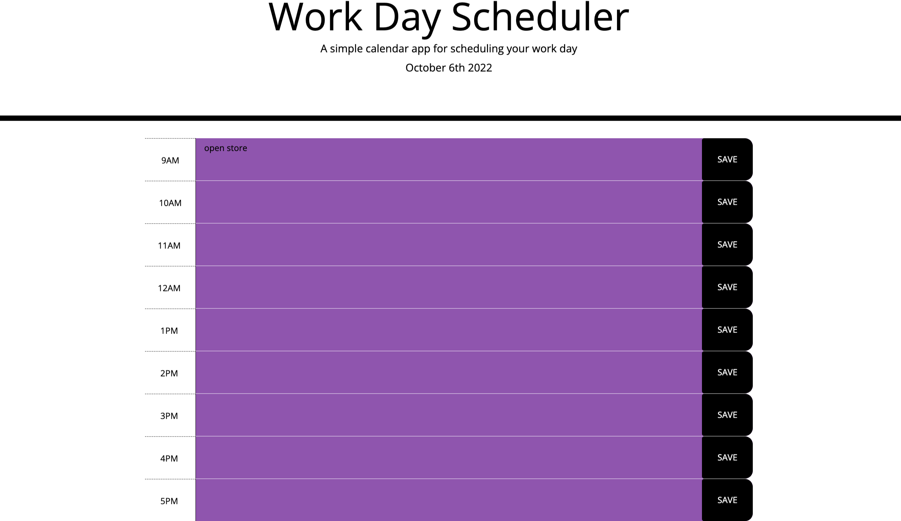

# Work Day Scheduler

## Descriptions

The Work-Day-Scheduler is a productivity app that allows businesses and individuals to schedule their work day efficiently. It provides a user-friendly interface to fill out and save tasks and important information. This app is built using HTML, CSS, Bootstrap, jQuery, and Moment.js.

# Features
- Displays the work hours of the day from 9 AM to 5 PM.
- Shows the current day and date.
- Time blocks are color-coded to indicate past (purple), present (blue), and future (orange) times.
- Provides input fields and a save button to store and manage the schedule.
- Compatible with both desktop and mobile devices.

## Usage
- Open the webpage through the following link: Work-Day-Scheduler
- The current day and date will be displayed at the top of the calendar.
- Each time block represents one hour of the work day.
- Input your tasks or events in the corresponding time blocks.
- Click the "SAVE" button to store your schedule.
- The saved events will persist even after refreshing the page.

## Screenshot

## Test
You can test the Work-Day-Scheduler by visiting the webpage using the following link: [Work-Day-Scheduler](https://eedouard28.github.io/calender-app/)

## Author
Work-Day-Scheduler is developed by Evince Edouard.

Feel free to reach out to the author with any questions or feedback.

## License
This project is licensed under the MIT License.
